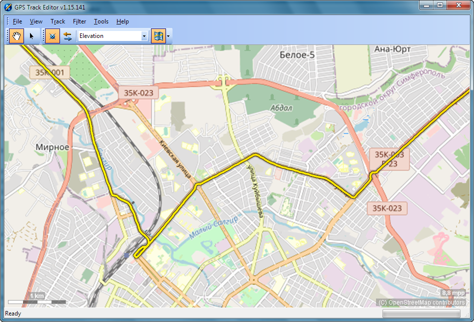
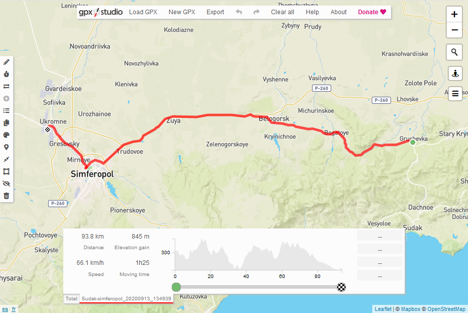

# GPS track recorder for Symbian OS based phones

This software allows you to record your trip using Nokia phone.

 

From recorded track you can know travelled distance, average speed, elevation and many other information using [miscellaneous tools](#see-also).

 

This application is GUI fork of my previous [console version](https://github.com/artem78/s60-gps-tracker-cli).

## Using
Start application. Track recording will start automatically when position from satellites will be recieved. You can pause track recording (for example: when you have a rest). All tracks save in [GPX](https://en.wikipedia.org/wiki/GPS_Exchange_Format) format in `c: or e:\data\GPSTracker\tracks` directory. Close program for stop track writing. After this you may transfer GPX-file to your PC for future use.

## Track samples
* Car driving - [https://www.openstreetmap.org/user/artem78/traces/3391464](https://www.openstreetmap.org/user/artem78/traces/3391464)

## Localization
* English
* Russian (Русский)

## Tasks
* List of tracks
   * [x] Show track info: file size, distance, points count, date, etc...
   * [ ] Send track file via sms/email/bluetooth
   * [x] Delete files
* File formats
   * [ ] KML
   * [ ] NMEA
* Settings
   * [ ] Use static or dinamic position requestor
   * [ ] Change position update interval
   
## See also
### Useful tools:
 - [GPS Track Editor](http://www.gpstrackeditor.com/)
 - https://maplorer.com/view_gpx.html
 - https://www.mygpsfiles.com/app/
 - https://gpxstudio.github.io/
