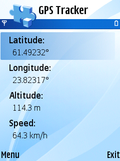
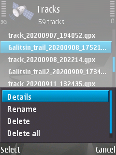

GUI fork of [console GPS Tracker](https://github.com/artem78/s60-gps-tracker-cli) for Symbian OS.

 

## Track samples
* Car driving - [https://www.openstreetmap.org/user/artem78/traces/3391464](https://www.openstreetmap.org/user/artem78/traces/3391464)

## Localization
* English
* Russian (Русский)

## Tasks
* List of tracks
   * [x] Show track info: file size, distance, points count, date, etc...
   * [ ] Send track file via sms/email/bluetooth
   * [x] Delete files
* File formats
   * [ ] KML
   * [ ] NMEA
* Settings
   * [ ] Use static or dinamic position requestor
   * [ ] Change position update interval
